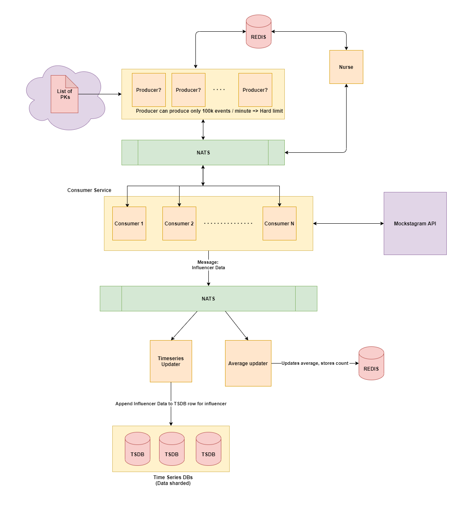
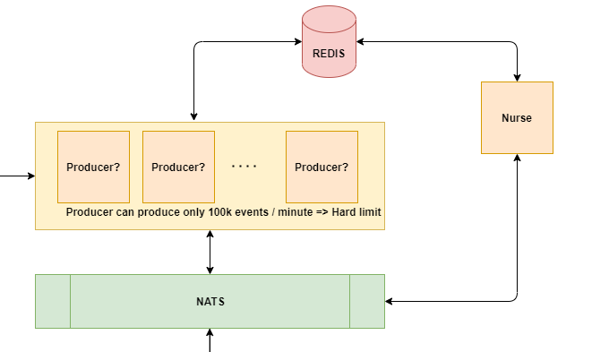

# Mockstagram (Partial)

A simple Event driven architecture that shows how communication between replicas of the same service works. This codebase shows a demo project of how multiple replicas of a server (lets call it **producer**) know about the correct server number they are associated to and what the total number of servers at any given moment.

An architecture diagram of a much bigger system is seen below: (The draw.io file is seen in the docs folder)

<div style="text-align:center"></div>

The code implemented in this demo project is just a tiny sliver of this architecture:

<div style="text-align:center"></div>

The way this is achieved is by storing this global map of producer replica serverName and its associated server number onto a shared Redis instance. (I have used a simple hash map to store [serverName] : [serverNumber] and one simple redis key to store the total number of servers [mockstagram:TOTAL] : [number]). A single replica of another type of serve (lets call it **nurse**) is responsible for monitoring the health of the producers. Should any producer go down, it is the job of the nurse to clean up its corresponding mapping entry in Redis and recalculates the total number of replicas of the producer is running and updates Redis.

At any given time, if any of the producer replicas want to know what their serverNumber is, they can simply query Redis with their serverName to obtain that value.

## Prerequisites

- Docker & Kubernetes (Running locally) (I used docker desktop on windows, so it was easy to setup)
- [Scaffold.dev](https://skaffold.dev/) (Helps managing all pods and deployments)
- NodeJS

## Setup

```bash
  # This will setup all the deployments and services on your local k8s. Make sure you are connected to k8s
  > skaffold dev
```

When you run the above command, you will see the docker images being built for the services:"

- mk-producer (4 replicas as seen in the mk-producer-depl.yaml file)
- mk-nurse
- nats-streaming-server
- redis

After the images are built, they shall be deployed on your default k8s cluster namespace, and you will see the logs of all the **services** exposed on that same terminal. View [docs/terminalLogs.md](docs/terminalLogs.md) to view an in depth example.

## Future Scope

- Improve code sharing between micro services (Something like yarn workspaces maybe?)
- Write Test cases to test all these various components
